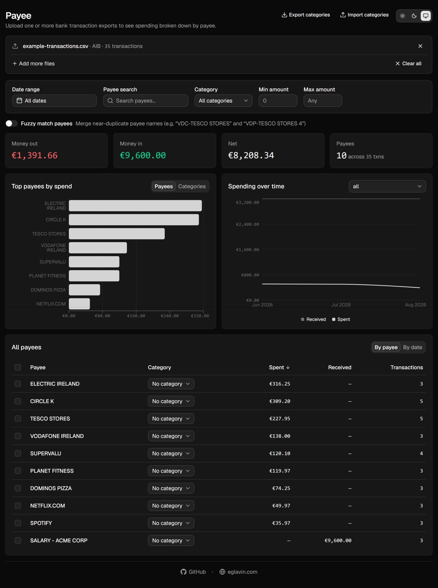

# Payee

A bank transaction dashboard that turns AIB and Revolut CSV exports into a breakdown of spending by payee - parsed entirely in your browser, nothing ever leaves your device.

**Live:** [payee.eglavin.com](https://payee.eglavin.com)

## What it does

- **Upload CSV exports** from AIB or Revolut (drag & drop or file picker) - one or several files at once, even mixing banks.
- **Groups transactions by payee**, with an optional fuzzy-matching mode that merges near-duplicate names (e.g. "VDC-TESCO STORES" and "TESCO STORES 4") into a single payee.
- **Categorize payees** - tag payees into built-in categories (Groceries, Takeout & Restaurants, Bills & Utilities, Transport, and more) or your own custom ones, from the payee table or its detail view. Multi-select and bulk-tag several payees at once (with a confirmation prompt above 10). Category assignments are saved to your browser's local storage, keyed off a normalized payee name, so they reattach automatically the next time you upload a similar export.
- **Export/import your categories** as a JSON file, to back them up or move them between browsers/devices.
- **Filter** transactions by date range (with quick presets), payee search, bank, category, and amount range.
- **Charts**: top payees or top categories by spend, and a spending trend over time.
- **Payee detail view**: the full transaction list for a payee, its own spend-over-time chart, and category assignment.
- **Select and export** any set of transactions to a plain-text file.
- **Try it instantly** with a built-in example dataset (10 payees, 35 transactions across 3 months) - no file needed.
- Light / dark / system theme.

## Privacy

Files are parsed entirely client-side (with PapaParse) - nothing is uploaded to a server. The only thing persisted between visits is your category tags (in `localStorage`); uploaded transactions are cleared once you close the tab.

This is not a financial advisor - it only visualizes the transactions you give it and doesn't offer financial, investment, or tax advice.

## Supported bank formats

| Bank    | Format                                    |
| ------- | ------------------------------------------ |
| AIB     | CSV export from AIB's online banking        |
| Revolut | CSV export from the Revolut app             |

New formats can be added under `src/lib/formats/` - see `src/lib/formats/types.ts` for the shape a format needs to implement (`matchesHeader` + `parse`).
